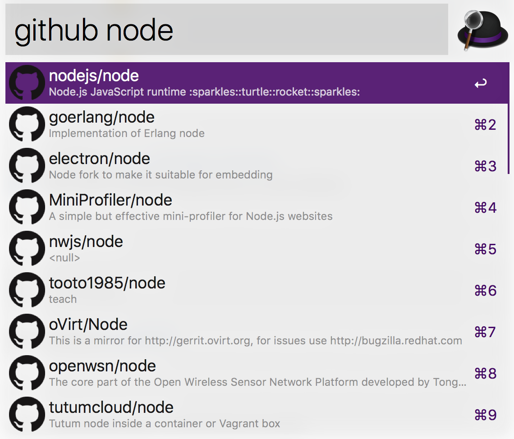

# alfred-github

> Alfred workflow to find to projects in GitHub



Runs against `api.github.com` without authentication. Too many requests (>10 per minute) will result in **Forbidden** errors.

## Install

```
$ npm install -g alfred-github
```

*Requires [Node.js](https://nodejs.org) 12.20+ and the Alfred [Powerpack](https://www.alfredapp.com/powerpack/).*


## Usage

In Alfred, type `github`, <kbd>Enter</kbd>, and the repo you're looking for.

Select the project you're looking for and open it up in your browser by hitting <kbd>Enter</kbd>.

Hold <kbd>command</kbd> to display the count of Star and Fork.

## License

MIT © [anoff](https://github.com/anoff)
